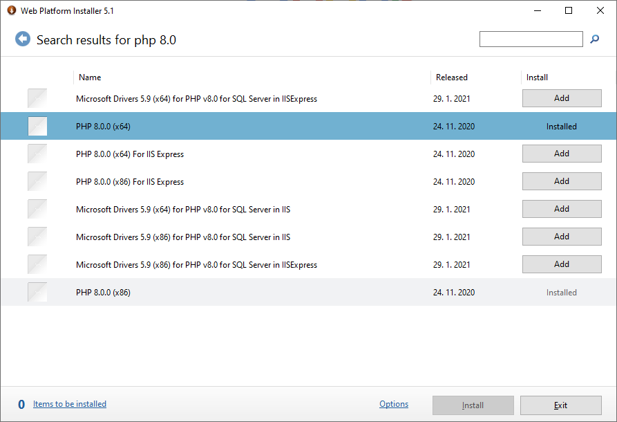
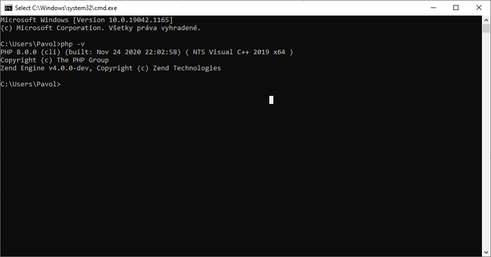
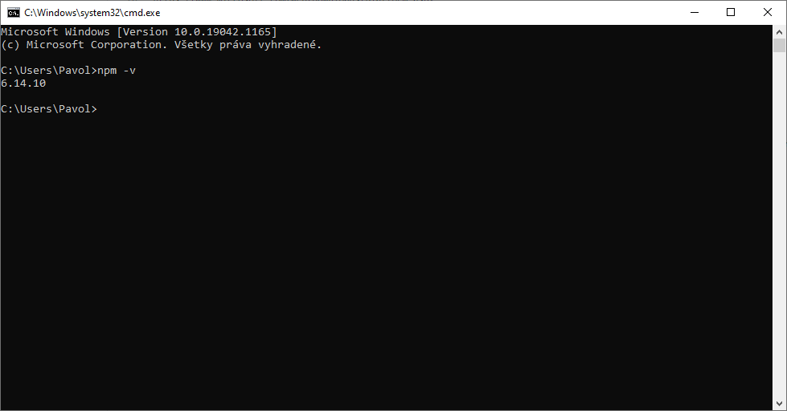

# Vytvor si vlastnú web aplikáciu v PHP s frameworkom Laravel

## Pred začiatkom kurzu

Predtým než začneme si potrebujeme nainštalovť niekoľko nástrojov, ktoré budeme používať počas tohto kurzu. 
Ak budeš mať s čímkoľvek problém, ničoho sa neboj. Budeme mať priestor na začiatku kurzu, kde môžeme spolu vyriešiť akékoľvek problémy s inštaláciou 😉

### Nainštaluj si niektorý z pokročilejších editorov (ideálne PHPStorm)

#### PHPStorm - ideálny editor pre PHP projekty, ktorý môžeš získať nasledovne:

- môžeš požidať o bezplatnú študentskú verziu https://www.jetbrains.com/community/education/#students
- prípadne si nainštaluj skúšobnú verziu na 30 dní pre potreby tohto kurzu https://www.jetbrains.com/phpstorm/

#### VSCode 
  - bezplatný editor od Microsoftu, ktorý si môžeš stiahnuť tu https://code.visualstudio.com/download

### Nainštaluj si Microsoft Web Platform Installer (iba Windows)

https://www.microsoft.com/web/downloads/platform.aspx

### Nainštaluj si PHP 8.0 pomocou Microsoft Web Platform Installer (iba Windows)
- spusti MS Web Installer zo štart menu
- do vyhľadávania vpravo hore napíš `php 8.0`
- klikni na `Add` a potom na `Install` a potvrď inštaláciu



### Nainštaluj si PHP 8.0 na Macu
- najprv zisti akú verziu PHP máš nainštalovanú pomocou tohto prílazu v termináli `php -v` - ak už máš verziu 8 môžeš preskočiť nasledujúce 2 kroky
- nainštaluj si Homebrew https://brew.sh/
- nainštaluj si PHP 8.0 podľa tohto návodu https://stitcher.io/blog/php-8-upgrade-mac

### Po inštalácii PHP potrebujeme pridať nasledovný riadok do súboru php.ini
 - vo Windowse nájdeš súbor php.ini tu: `C:\Program Files\PHP\v8.0`
 - na Macu nájdeš tento súbor tu: `/private/etc/php.ini`

Na koniec súboru pridaj tento riadok
```
extension=php_fileinfo.dll
```

### Stiahni a nainštaluj si Node.JS
- https://nodejs.org/dist/v14.17.3/node-v14.17.3-x64.msi

### Overenie, či sa všetko nainštalovalo správne
- spusti príkazový riadok pomocou `Win + R` (na Windowse) alebo Terminál (na Macu)
- zadaj nasledovný príkaz `php -v` a stlač `enter`
- ak uvidíš nasledovné, PHP sa nainštalovalo správne a môžme začať programovať :)



- potom zadaj tento príkaz `npm -v` a stlač `enter`
- ak uvidíš nasledovné, NodeJS sa nainštaloval správne



### Stiahni a rozbaľ si tento súbor s aplikáciou, s ktorou budeme pracovať (napríklad na plochu)

### Spusti s

### Môžeš si stiahnuť a prezrieť pomôcky z predchádzajúcich kurzov HTML a CSS frameworkov
- https://github.com/pavolsenko/kurz-laravel/blob/master/tvorime_web_1.pdf
- https://github.com/pavolsenko/kurz-laravel/blob/master/tvorime_web_2.pdf


